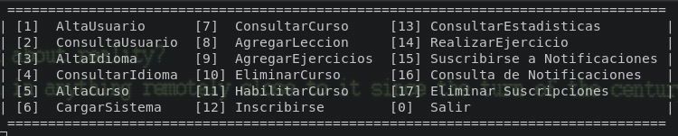

# LangLearnHub

**Description**

The application aims to facilitate the learning of new languages through a didactic methodology based on interactive exercises. It provides tools to register courses, teachers, and students, allowing enrollment in courses and the completion of exercises. Additionally, there are plans to implement collaborative features and automatic adaptation of exercises in future versions.

**Registered Users**

**Teachers:**
- Registration with nickname, password, name, and description.
- Additional information: institute of work and specialized languages.
- Creation and proposal of courses based on their specialization.

**Students:**
- Registration with nickname, password, name, and description.
- Additional information: country of residence and date of birth.

**Course Catalog**

A comprehensive catalog in different languages.
Catalog details: course name, description, language taught, difficulty level.
Teachers are responsible for proposing and creating courses.

**Enrollment in Courses**

Students can enroll in available courses.
Recording the date of enrollment.
Some courses have prerequisites that must be completed.

**Student Progress**

Monitoring through "memory full" graphics.
Comparison of progress between students.
Advancement to the next lesson conditioned on the approval of all exercises from the previous lesson.

**Lessons and Exercises**

Each course consists of lessons.
Lessons with specific objectives and one or more exercises.
Choice of exercises by the student.
Current support for fill-in-the-blank and translation exercises.

**Assessment and Approval**

A course is considered approved when the student passes all exercises in their lessons.


## How to Run the Program

To compile and run the program, follow these steps:

1. Open a terminal in the root directory of the project.

2. Run the following command to compile the program using `make`:

   ```bash
   make
   ```

   This should compile the source code and generate the `main` executable.

3. Once the compilation is complete without errors, you can run the program with the following command:

   ```bash
   ./main
   ```

  




